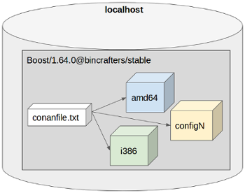
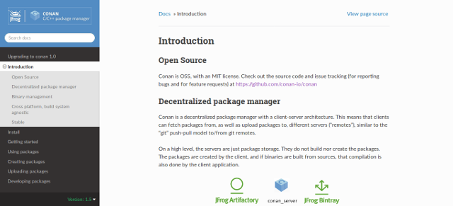
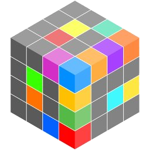

## Conan.io

#### The C/C++ Package Manager for Developers

FISL18

---?image=assets/img/lego-dark-green.png
@title[About me]

@div[left-70]
Hello!
<br>
<br>
**Uilian Ries**
<br>
<br>
C++ and Python Developer
<br>
Work at **@khomp**
<br>
<br>
@uilianries
<br>
@fa[github] @fa[twitter] @fa[linkedin]
@divend

@div[right-30]

@divend

---?image=assets/img/vaga-khomp.png
@title[Khomp]

---?image=assets/img/lego-dark-red.png

### POPULAR C/C++ PROJECTS

##### Because you need good libraries

---?image=assets/img/lego-dark-blue.png
@title[A New Project]

Let's start a new C++ project!

What does it need?

@div[left-50]
<ul>
  <li>OpenSSL</li>
  <li>Qt</li>
  <li>Boost</li>
  <li>OpenCV</li>
  <li>POCO</li>
</ul>
@divend

---?image=assets/img/lego-dark-green.png

#### ALL OF THEM NEED TO BE BUILT

* Download the source. Build on your machine
  - It may take several minutes, or even hours
  - There may be external dependencies
  - You need to know how to build

* Install by system package manager
  - The version may not be as expected
  - There may be a patch applied

---?image=assets/img/lego-dark-green.png

#### Build from source? Install from distro?


---?image=assets/img/lego-dark-red.png

### PACKAGE MANAGERS

##### How to avoid *externals* in your project

---?image=assets/img/lego-dark-green.png

#### POPULAR PACKAGE MANAGERS

@div[left-50]
<br>
<ul>
  <li>Python</li>
  <ul>
    <li>pip, Conda</li>
  </ul>
  <li>Rust</li>
  <ul>
    <li>Cargo</li>
  </ul>
  <li>Java</li>
  <ul>
    <li>Maven</li>
  </ul>
  <li>JavaScript</li>
  <ul>
    <li>npm</li>
  </ul>
</ul>
@divend
@div[right-50]

@divend

---?image=assets/img/lego-dark-blue.png
@title[CppCon 2017]


---?image=assets/img/lego-dark-blue.png

#### C++ UNIVERSE

@div[left-50]
<br>
<ul>
  <li>CONAN</li>
  <li>HUNTER</li>
  <li>BUCKAROO</li>
  <li>VCPKG</li>
  <li>CGET</li>
  <li>CPM</li>
<ul>
@divend
@div[right-30]

@divend

---?image=assets/img/lego-dark-red.png

## CONAN

Not the barbarian


---?image=assets/img/lego-dark-blue.png

#### CONAN

@div[left-70]
<br>
<ul>
  <li>FOSS</li>
  <li>MIT License</li>
  <li>Decentralized, GIT style</li>
  <li>Handles from source/binaries</li>
  <li>Generators for CMake, VS, XCode, qmake …</li>
  <li>Developed in Python</li>
  <li>+100 contributors</li>
  <li>2K stars (Github)</li>
</ul>
@divend
@div[right-30]

@divend

---?image=assets/img/lego-dark-green.png

### INSTALL

`$ pip install conan`

---?image=assets/img/lego-dark-red.png

### CONAN IN ACTION
@title[Conan in Action]

Talk is cheap. Show me the code.


---?image=assets/img/lego-dark-green.png

#### CONAN IN ACTION
@title[Conan in Action File - Propose]

* Digest MD5 using Poco project
* Check string by Boost Regex
* Build using CMake


---?image=assets/img/lego-dark-green.png

#### CONAN IN ACTION
@title[Conan in Action - Project Structure]

```
example
|   main.cpp
|   conanfile.txt
|   CMakeLists.txt
```

---?image=assets/img/lego-dark-green.png

#### CONAN IN ACTION
@title[Conan in Action - main.cpp]

main.cpp

```cpp
#include <Poco/MD5Engine.h>
#include <boost/regex.hpp>
#include <iostream>

int main() {
    Poco::MD5Engine md5;
    md5.update("Hello World");
    std::string md5string = Poco::DigestEngine::digestToHex(md5.digest());
    std::cout << "MD5= " << md5string << '\n';

    boost::regex expr{R"(\w+\s\w+)"};
    std::cout << boost::regex_match("Hello World", expr) << '\n';
    return EXIT_SUCCESS;
}
```

@[6-9]
@[11-12]

---?image=assets/img/lego-dark-blue.png

#### CONAN IN ACTION
@title[Conan in Action - conanfile.txt]

conanfile.txt

```
[requires]
Poco/1.9.0@pocoproject/stable
boost/1.67.0@conan/stable

[generators]
cmake
```

@[1-3]
@[5-6]

---?image=assets/img/lego-dark-green.png

#### CONAN IN ACTION
@title[Conan in Action - CMakeLists.txt]

CMakeLists.txt - **TARGET**

```cmake
cmake_minimum_required(VERSION 2.8)
project(example CXX)

find_package(Boost 1.67.0 REQUIRED regex)
find_package(Poco 1.9.0 REQUIRED Foundation)

add_executable(example main.cpp)
target_link_libraries(example ${Boost_LIBRARIES} ${Poco_LIBRARIES})
```

@[1-2]
@[4-5]
@[7-8]

---?image=assets/img/lego-dark-green.png

#### CONAN IN ACTION
@title[Conan in Action - CMakeLists.txt (Conan)]

CMakeLists.txt - **WITH CONAN**

```cmake
cmake_minimum_required(VERSION 2.8)
project(example CXX)

include(${CMAKE_BINARY_DIR}/conanbuildinfo.cmake)
conan_basic_setup()

add_executable(example main.cpp)
target_link_libraries(example ${CONAN_LIBS})
```

@[1-2]
@[4-5]
@[7-8]

---?image=assets/img/lego-dark-green.png

#### CONAN IN ACTION
@title[Conan in Action - Conan Install]

How to Build

`$ conan install .`

```
PROJECT: Installing /home/conan/project/conanfile.txt
Packages
    OpenSSL/1.0.2o@conan/stable:0abbb2ea17cdc92f4a2ac8a9e55de717e3b5a9d1
    Poco/1.9.0@pocoproject/stable:8a67b44a092c0074e3cb946a9ddada338054b11e
    boost/1.67.0@conan/stable:eacfdb5f448bfd89f0b2950fb6b7a79e44c7ea08
    bzip2/1.0.6@conan/stable:76f87539fc90ff313e0b3182641a9bb558a717d2
    zlib/1.2.11@conan/stable:d358fec34c04bcd89832a09158783c750a3304dc
PROJECT: Generator cmake created conanbuildinfo.cmake
PROJECT: Generated conaninfo.txt
```

---?image=assets/img/lego-dark-green.png

#### CONAN IN ACTION
@title[Conan in Action - Build]

How to Build

```
$ conan install .
$ cmake .
$ cmake --build .
$ bin/example
```

@[1]
@[2]
@[3]
@[4]

---?image=assets/img/lego-dark-blue.png

#### CONAN IN ACTION
@title[Conan in Action - The Result]

* Install Boost 1.67.0 binaries
* Install Poco 1.9.0 binaries
* CMake helper
* It works for Linux, Windows, Macos, FreeBSD, ...


---?image=assets/img/lego-dark-red.png

### CONAN IN A NUTSHELL

How it works.


---?image=assets/img/lego-dark-blue.png

#### UNDERSTANDING CONAN

* Package naming
* System setup
* Package distribution
* Local cache

---?image=assets/img/lego-dark-green.png

#### PACKAGE NAMING

**`name/version@user/channel`**

* Examples
  * Poco/1.9.0@pocoproject/stable
  * Boost/1.67.0@conan/testing
  * Qt/5.11.0@bincrafters/stable

---?image=assets/img/lego-dark-green.png

#### SYSTEM SETUP

* Based on Profiles

**Conan settings + Host configuration = Profile**

---?image=assets/img/lego-dark-green.png

#### PROFILE

`$ conan profile show default`

```
Configuration for profile default:

[settings]
os=Linux
os_build=Linux
arch=x86_64
arch_build=x86_64
compiler=gcc
compiler.version=8
compiler.libcxx=libstdc++11
build_type=Release
[options]
[build_requires]
[env]
```

---?image=assets/img/lego-dark-green.png

#### PACKAGE DISTRIBUTION

* Git flavor
* Support multiple remotes
* Central repository - JFrog Bintray
* Easy to run a local server instance
  * `$ conan_server`
* JFrog Artifactory can be used together

---?image=assets/img/lego-dark-red.png

#### PACKAGE DISTRIBUTION


---?image=assets/img/lego-dark-green.png

#### LIST REMOTES

`$ conan remote list`

```
my-company: http://172.0.1.42:9300
conan-center: https://conan.bintray.com
bincrafters: http://api.bintray.com/conan/bincrafters/public-conan
```

---?image=assets/img/lego-dark-green.png

#### LOCAL CACHE

Conan Package = **1** recipe, **N** binary packages



---?image=assets/img/lego-dark-green.png

#### PACKAGE ID

`$ conan search boost/1.67.0@conan/stable`

```
Existing packages for recipe boost/1.67.0@conan/stable:

    Package_ID: eacfdb5f448bfd89f0b2950fb6b7a79e44c7ea08
        [options]
            fPIC: False            
            shared: False            
        [settings]
            arch: x86_64
            build_type: Release
            compiler: gcc
            compiler.libcxx: libstdc++
            compiler.version: 5
            os: Linux
        [requires]
            bzip2/1.0.6@conan/stable:76f87539fc90ff313e0b3182641a9bb558a717d2
            zlib/1.2.11@conan/stable:d358fec34c04bcd89832a09158783c750a3304dc
```

---?image=assets/img/lego-dark-red.png

### CREATING PACKAGES

How a recipe looks like.

---?image=assets/img/lego-dark-green.png

#### CREATING PACKAGES
@title[Creating Packages - conanfile.py]

```python
from conans import ConanFile, CMake, tools

class HelloConan(ConanFile):
    name = "hello"
    version = "0.1.0"
    settings = "os", "compiler", "build_type", "arch"
    generators = "cmake"

    def build(self):
        cmake = CMake(self)
        cmake.configure()
        cmake.build()
        cmake.install()

    def package_info(self):
        self.cpp_info.libs = ["hello"]
```

---?image=assets/img/lego-dark-green.png

#### CREATING PACKAGES
@title[Creating Packages - Create]

`conan create . uilianries/testing`

```
hello/0.1.0@uilianries/testing: Exporting package recipe
hello/0.1.0@uilianries/testing: WARN: Forced build from source
hello/0.1.0@uilianries/testing: Installing package
Requirements
    hello/0.1.0@uilianries/testing from local cache - Cache
Packages
    hello/0.1.0@uilianries/testing:56e0cf6d16ee57367a0661ab743f4e43b29223f8 - Build

hello/0.1.0@uilianries/testing: Building your package in
hello/0.1.0@uilianries/testing: Copying sources to build folder
hello/0.1.0@uilianries/testing: Generator cmake created conanbuildinfo.cmake
...
```

---?image=assets/img/lego-dark-red.png

### COMMUNITY

Sharing data is the first step toward community.

---?image=assets/img/lego-dark-blue.png
@title[Github]

https://github.com/conan-io/conan


---?image=assets/img/lego-dark-blue.png
@title[Conan docs]

https://docs.conan.io



---?image=assets/img/lego-dark-green.png
#### BINTRAY AS DOWNLOAD CENTER

* https://bintray.com/conan
* Frog’s solution
* Conan Center: +100 recipes

---?image=assets/img/lego-dark-blue.png

#### BINCRAFTERS

@div[left-70]
<br>
<ul>
  <li>https://bincrafters.github.io</li>
  <li>Packaging OSS Software</li>
  <li>~20 members and growing</li>
  <li>+200 recipes, including:</li>
  <ul>
    <li>Boost, Abseil, Azure, Qt</li>
  </ul>
  <li>Thanks to @solvingj, @SSE4, @grafikbot, @theirix, @madebr</li>
</ul>
@divend
@div[left-30]

@divend

---?image=assets/img/lego-dark-white.png

#### REFERENCES

* https://github.com/conan-io/conan
* https://github.com/bincrafters
* https://conan.io
* https://docs.conan.io
* https://github.com/memsharded/four-c-example
* [CppCon 2016: Conan, a C and C++ package manager for developers](https://youtu.be/xvqH_ck-5Q8)
* https://bintray.com/conan
* [Programming C++ With The 4 Cs: Clang, Cmake, Clion And Conan](https://blog.conan.io/2016/05/10/Programming-C++-with-the-4-Cs-Clang,-CMake,-CLion-and-Conan.html)

---?image=assets/img/lego-dark-white.png

### THANK YOU!

##### Questions ?

You can find me on:  

**@uilianries** - twitter, github  
cpplang.slack.com - channel #conan or #bincrafters  
uilianries@gmail.com  
